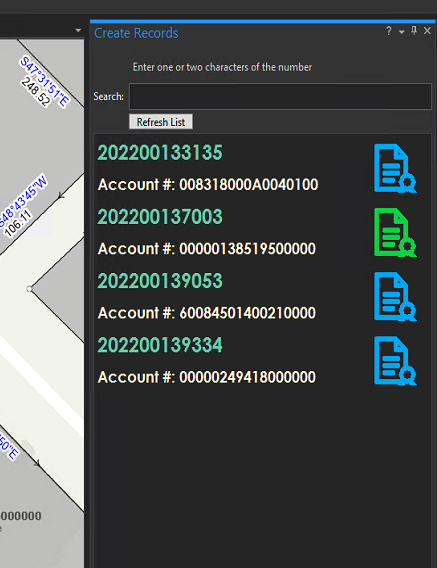
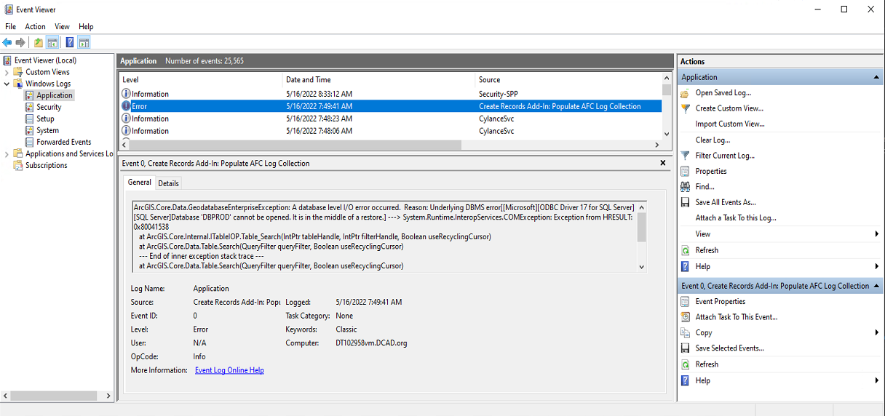
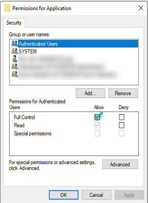

# pro-createrecords-addin

## Table of Contents
* [Introduction](#introduction)
* [Architecture](#architecture)
* [Integration](#integration)
* [Deployment](#deployment)
* [Usage](#usage)
* [Revision History](#revision-history)

### Introduction
This project represents an ArcGIS Pro 2.9 SDK Add-In that reads a database view and 
displays view data within a custom list nested within a dockpane.

### Architecture
A combination of directories contain sql queries, c# files, images, and documentation files.
Their purpose and contents include:

 * DarkImages - Images for ArcGIS Pro's dark theme.
 * Docs       - This README.MD document.
 * Images     - Images for ArcGIS Pro's light theme.
 * Libraries  - Custom c# libraries
 * SQL        - Sql queries that identify the data source for the dock pane.
 * Root       - C#, .daml, and .xaml files that makup the MVVM Addin.

### Integration
In order to view AFC logs that are relevant to the user, 
a database view will be created showing those already assigned 
to the user using Message Central. This approach has to be used because AFC logs, 
at the moment, cannot be assigned to users from ArcGIS Pro.
One of the goals of this project is to format record names so they
 match the formatting of Legal Line 4 in the Mars application. 
To do this, the record name will be constrained to twelve characters
 in one of two formats. The [instrument number](#Instrument_Number) and [research form ID](#Research_Form_ID).

#### Instrument Number

The instrument number format is proprietary to the Dallas County Clerk’s
Office and consists of twelve numeric digits. The first four digits 
represent the year in which the document was recorded and the remaining
eight digits represent a sequence of documents. For example, the instrument
number 202200000001 represents the first document recorded in 2022.

#### Research Form ID

The research form ID is an alphanumeric identifier that combines the year
that the DCAD research request was initiated, the month and day it was 
entered into the system and a sequence number identifying its order of 
entry for that date. For example, 2022-0314-03 represents a research form 
that was the third entered on March 14, 2022. This identifier contains 
alphanumeric characters because of the dash included in the number. 

#### Dock Pane Window
The dockpane window will display current AFC logs that are currently 
Active and have been assigned to the authenticated user. These will be 
bound to the dockpane and allow GIS Specialists to search for AFC logs 
within the ArcGIS Pro project. The Add-In will import select columns 
from the AFC_LOG database table formatted for a quick view to help 
identify the AFC log for the GIS specialist. The pane has been enhanced to
display font colors with contrast appropriate for the application theme.

### Deployment
This Add-In will be made available to users through a network share. 
The network share is [\\\\dcad.org\GIS\Source\AddInsPro](#\\dcad.org\GIS\Source\AddInsPro). 
Any user that has the network share mapped in the ArcGIS Pro 
application can access the Add-In and use it when opening ArcGIS Pro.

### Usage
To use the Add-In, the well-known folder must be supplied in the project's options
found in the backstage. See [Deployment](#Deployment). The Add-In will be available
in the Add-Ins tab with the title **Show Create AFC Records Dock Pane**.

 1. Click the button and wait for the dock pane to load.
 2. The AFC log list will load when the dock pane is displayed.
 3. If the expected AFC log is not found in the list, it may already have 
    an existing record. Make sure that record for the specific AFC log does 
    not already exist or that the AFC log has been assigned to you in Message 
    Central.

### Logging
This application interfaces with the Windows Event Log. When an exception is thrown
in the application for some methods, it is written to the Windows Application Event Log.

#### Granting Permission to Write to the Application Event Log
Permission must be given in order to the authenticated
user in order to write to the log. Follow the steps below to provide access:

 1. Open regedit.
 2. Navigate to `HKEY_LOCAL_MACHINE\System\CurrentControlSet\Services\EventLog\Application`
 3. Right click the `Application` directory and select *Permissions...*
 4. Make sure that Authenticated Users have Full Control. Click ok and exit regedit.
 

----
## Revision History

|*Date*|*Rev*|*Description*|*Author*|
|------|-----|-------------|--------|
|06/28/21|1.0|Initial Release|John W. Fell|
|05/12/22|1.1|Added libraries directory|John W. Fell|
|06/08/22|1.2|Added SQL views to remove deleted records|John W. Fell|
|08/09/22|1.3|Added logic for checking the environment based on the active portal|John W. Fell|

----
##### Footnotes
